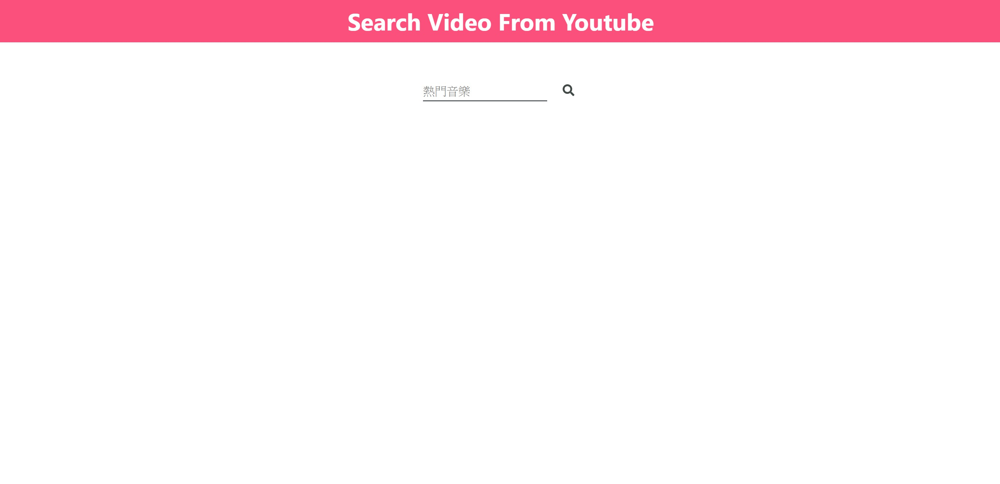

This project was bootstrapped with [Create React App](https://github.com/facebook/create-react-app).

## Available Scripts

In the project directory, you can run:

### 啟動專案

`npm start`

### F2E

- React.js
- [react-paginate plugin](https://github.com/AdeleD/react-paginate)
- [youtube api v3](https://developers.google.com/youtube/v3/docs/search/list)

> ※ API_KEY 使用次數可能已盡，需要自己產生另一組。

